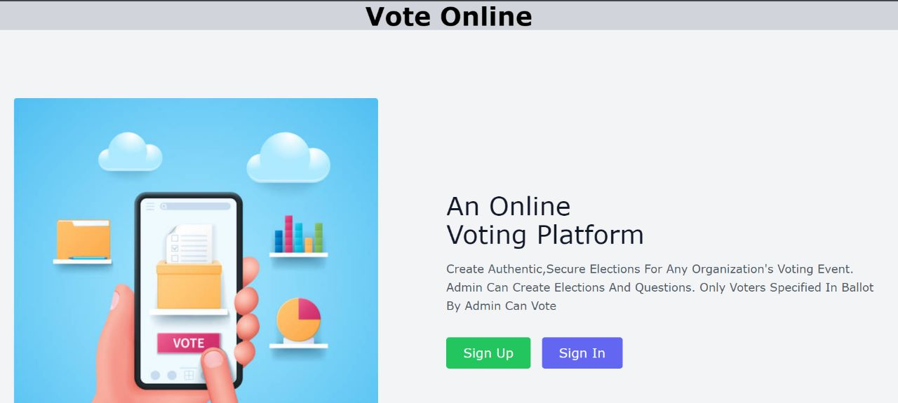

# VoteOnline
An Online Voting Platform To Conduct Authentic, Secure Elections For Any Organization's Voting Event. 
## Hosting Link
[https://voteonline.onrender.com](https://voteonline.onrender.com)
### Web App Main Functionalities
* Create Election With Various Questions
* Only Voters Listed In Election Ballot Can Vote
* Get A Unique URL For Every Election's Voting Page
* Voters Can Login And Cast Their Vote Through Above Mentioned URL
* Questions, Options, Election Details, Voters Details Can Be Editable Before Starting The Election
* Admin Can Preview Elections Results While It's Running And Get Live Updates
* Pie Charts And Graphs Are Used To Show The Results In A Clutter Free Form
### Steps To Use
1. Sign Up
2. Create A New Election
3. Add Atleast One Question And One Voter To The Election Ballot
4. Make Sure To Add Atleast Two Options To Every Question
5. Preview The Election, Then Start
6. Share Public URL With Listed Voters
7. Check Election Progress By Selecting `Check Results`
8. Stop The Election By Selecting `End The Election`
9. Results Will Be Displayed
#### Application Screenshots

